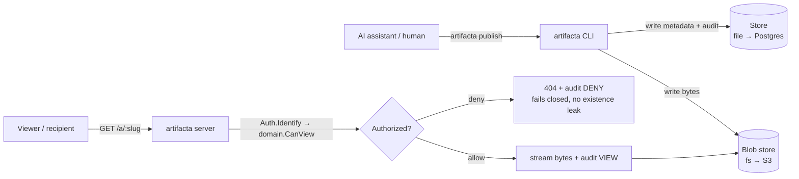

<div align="center">

# ArtifactA

### Self-hostable host for AI-generated artifacts

**Publish an artifact your AI assistant generated — an HTML page, a report, a dashboard — and get a
private, access-controlled link on infrastructure _you_ own.** No third-party share links. Storage,
access control, and a tamper-evident audit trail all stay on infra you control.

`artifacta publish ./report.html` → `https://your-host/a/x7Kp2q` — private by default.

</div>

---

## At a glance

|                          |                                                                                                                                                                                                                             |
| ------------------------ | --------------------------------------------------------------------------------------------------------------------------------------------------------------------------------------------------------------------------- |
| **What it is**           | A self-hostable service that stores and serves AI-generated artifacts behind your own auth.                                                                                                                                 |
| **The problem it kills** | AI share links persist sensitive data (PII, internal analytics, dashboards) on a vendor's cloud you don't govern.                                                                                                           |
| **What you get**         | A private `/a/{slug}` link, per-artifact RBAC, a hash-chained audit trail — all on your infra.                                                                                                                              |
| **Shape**                | One Go binary: a CLI **and** a sandboxed viewer server. Zero external deps to start.                                                                                                                                        |
| **Status**               | **v0.1.0 — first stable release.** Publish + sandboxed viewer, searchable dashboard, browser upload, render parity (React/Markdown/Mermaid/SVG), file/Postgres store + S3 blobs, OIDC SSO. Images + CLI on GHCR & Releases. |

---

## Why

AI assistants generate artifacts that routinely contain sensitive data — customer PII, internal
analytics, credentials baked into a dashboard. Today those artifacts are **persisted on and served
from the AI vendor's infrastructure** (share links, hosted CDNs). For any team with a compliance
posture, that's an ungoverned dependency: the data lives, is served, and is (not) audited on infra
they don't control.

**ArtifactA removes the persistence + sharing dependency.** The artifact lives, is access-controlled,
audited, and expired entirely on infrastructure the operator owns.

> **Honest scope:** generation-time content still passes through whatever AI vendor produced it — this
> does not solve that. It solves **storage + serving + access control + audit**. The defensible claim is
> _"never stored on, nor retrievable from, third-party infra"_ — not _"PII never touches the vendor."_

---

## What it does

- 🚀 **One-command publish** — `artifacta publish <file>` returns a private link. Time-to-first-shared-link < ~2 min.
- 🔒 **Private by default** — every artifact is owner-only until you share it. Visibility: `PRIVATE` → `INVITED` → `ORG` → `LINK`.
- 🌐 **Subdomain hosting + no-login sharing** — serve a page at `{slug}.your-root` (or a custom `{label}.your-root`); the `LINK` level drops the login requirement for internal, VPN-gated hosting ([ADR-0017](docs/adr/0017-subdomain-artifact-addressing.md), [ADR-0018](docs/adr/0018-anonymous-vpn-gated-visibility.md)).
- 🤝 **Owner Share UI** — a dialog on each artifact to set visibility, **invite teammates by email**, and claim a subdomain, no CLI needed ([ADR-0019](docs/adr/0019-invite-by-email-grants.md)).
- 👥 **Per-artifact RBAC** — the allow/deny decision runs in the app, per artifact; grants bind to an immutable subject **or a verified email**.
- 🧾 **Inbuilt tamper-evident audit** — who-viewed-what, hash-chained in the app's own store, never routed to an external system.
- 🖼️ **Sandboxed viewer** — artifacts render in a null-origin, strict-CSP iframe (quality on par with the vendor viewer). In-page anchors scroll, external links open in a new tab, and forms work — while artifact JS stays walled off from the shell's session ([ADR-0027](docs/adr/0027-external-artifact-links-new-tab.md)).
- 🧩 **Render parity** — publishes what assistants actually emit: React/JSX, Markdown (GFM), Mermaid, SVG, and HTML — with an air-gapped, self-contained bundle mode ([ADR-0023](docs/adr/0023-flag-based-render-egress-and-multiformat.md)).
- 🔎 **Searchable dashboard** — card and list/table views with per-column sort/filter, search across everything you can see (yours, shared-with-you, org), and pagination. Publish from the browser too (upload UI, behind a toggle).
- 🕓 **Immutable versioning** — `artifacta publish --update <slug>` appends a new version; old versions stay addressable.
- 💬 **Anchored, threaded comments** — comment on selected text, pinned to a version, gated by view access.
- 🎨 **Per-deployment branding** — drop your org's logo and name in the navbar so it reads as your own tool.
- 🗄️ **Pluggable storage** — start on the zero-dep file store; flip to **Postgres** (GORM, auto-migrates on startup) for metadata and an **S3-compatible blob backend** (AWS/MinIO/R2/B2/Wasabi) for bytes for a fully horizontally-scalable deployment ([ADR-0009](docs/adr/0009-postgres-store-adapter.md), [ADR-0006](docs/adr/0006-s3-blob-adapter-backend-only.md)). An offline, resumable **`artifacta migrate`** moves a file-store deployment onto them without losing history.
- 🤖 **Assistant-agnostic** — publish from a CLI, REST API, MCP connector, or an assistant Skill (Claude & others).

---

## How it works



1. **Publish** — the CLI (or API/MCP/Skill) writes the artifact bytes to a **blob store** you control and its
   metadata + a `PUBLISH` audit record to the **store**. You get back a `/a/{slug}` link.
2. **View** — every request to `/a/{slug}` passes the app's **own authorization decision** before a single
   byte is served. Allow → stream + audit `VIEW`. Deny → `404` + audit `DENY` (**fails closed**, never leaks existence).
3. **Serve safely** — raw bytes are streamed from a **separate, cookieless content origin** into a sandboxed
   iframe, so artifact content can never reach a session cookie.

---

## Install the CLI

macOS / Linux — one line (detects your OS/arch, verifies the checksum):

```bash
curl -fsSL https://raw.githubusercontent.com/agarwalvivek29/artifacta/main/install.sh | sh
```

Pin a version or install location with `ARTIFACTA_VERSION` / `ARTIFACTA_INSTALL_DIR`. Or grab a
binary from the [latest release](https://github.com/agarwalvivek29/artifacta/releases/latest)
(Windows included). Prefer containers? `ghcr.io/agarwalvivek29/artifacta` (server + CLI) and
`ghcr.io/agarwalvivek29/artifacta-cli` (slim CLI).

---

## Quick start

```bash
# Prereqs: Go 1.26 toolchain, buf (schema codegen), pnpm (git hooks)
pnpm install

# Build the single binary (file store, zero external deps)
cd services/artifacta-api
go build -o /tmp/artifacta ./cmd/artifacta

# Log in, run the viewer, publish an artifact
ARTIFACTA_HOME=~/.artifacta /tmp/artifacta login
/tmp/artifacta serve &                       # viewer on http://localhost:8080
/tmp/artifacta publish ./some-artifact.html  # prints the private /a/{slug} link
```

Regenerate schema types after editing proto: `cd packages/schema && ./scripts/generate.sh`.

### CLI reference

| Command                                    | Does                                                   |
| ------------------------------------------ | ------------------------------------------------------ |
| `artifacta login`                          | Set up local identity + session token                  |
| `artifacta publish <file>`                 | Publish a new artifact, print its private link         |
| `artifacta publish --update <slug> <file>` | Append a new immutable version to an existing artifact |
| `artifacta versions <slug>`                | List an artifact's versions                            |
| `artifacta share <slug> <grantee-sub>`     | Share with a subject (sets visibility to `INVITED`)    |
| `artifacta ls`                             | List your artifacts                                    |
| `artifacta serve`                          | Run the viewer server                                  |
| `artifacta audit verify`                   | Verify the audit-log hash chain (file or Postgres)     |
| `artifacta upgrade`                        | Recommend the CLI version matching your deployment     |
| `artifacta doctor` / `whoami`              | Connectivity + auth health check; print your identity  |
| `artifacta migrate`                        | Offline file-store → Postgres/S3 data migration        |
| `artifacta version`                        | Print the build version                                |

Also available: `visibility`, `unshare`, `label`, `comment`, `healthcheck`, `search` — run `artifacta --help` for the full set.

---

## Under the hood

**Single service, two faces.** `artifacta-api` (Go) is one static binary that is both the CLI and the
viewer/REST server — trivial to self-host, low footprint.

### Service map

| Service         | Language | Type       | Responsibility                                           | Store                |
| --------------- | -------- | ---------- | -------------------------------------------------------- | -------------------- |
| `artifacta-api` | Go       | REST + CLI | Publish, authorization-gated viewer, RBAC, inbuilt audit | File (v0) → Postgres |

### Domain model (schema-first)

All domain types are defined in **protobuf** (`packages/schema/proto/artifacta/v1/`), generated to Go, and
imported by the service — **never redefined in service code**.

| Entity                   | Key fields                                           | Notes                                                                   |
| ------------------------ | ---------------------------------------------------- | ----------------------------------------------------------------------- |
| `Artifact`               | slug, owner_sub, visibility, content_type, label     | Visibility `PRIVATE → INVITED → ORG → LINK`; optional subdomain `label` |
| `ArtifactVersion`        | immutable versions                                   | Explicit `--update` appends; nothing is overwritten                     |
| `Grant`                  | slug, grantee_sub and/or grantee_email, granted_by   | Invite by subject or verified email; emits a `SHARE` audit event        |
| `Comment` + `TextAnchor` | version-pinned, view-gated                           | Anchored to selected text; threaded replies                             |
| `AuditEvent`             | seq, principal_sub, action, allowed, prev_hash, hash | Append-only **hash chain**                                              |

### Security model — the whole point

- **Private by default.** Identity comes from a verified token/session; grants bind to the immutable subject.
- **Authorize before bytes.** Bundle bytes are served **only** after an allow — no client-reachable pre-signed URLs.
- **Fail closed.** Missing artifact or store error → deny (`404`), and existence is never leaked.
- **Inbuilt audit.** Every allow and deny is recorded in a tamper-evident hash chain, in the app's own store.
- **Cookieless content origin.** Raw artifact bytes are served from a separate origin with no session cookie ([ADR-0008](docs/adr/0008-separate-content-origin.md)).
- **VPN-fronted.** Deployed behind the corporate VPN as the network perimeter; app auth + RBAC + audit are retained as **defense-in-depth** and for compliance ([ADR-0011](docs/adr/0011-vpn-fronted-threat-model.md)).

### Tech stack

| Layer   | Technology                                        | Why                                           |
| ------- | ------------------------------------------------- | --------------------------------------------- |
| Backend | Go (single CLI + server binary)                   | Trivial self-host, low footprint              |
| Schema  | Protobuf + buf (Go codegen)                       | One source of truth for domain types          |
| Store   | File **or** PostgreSQL (`ARTIFACTA_STORE`)        | Deployer's choice; GORM auto-migrates on boot |
| Blob    | Filesystem (v0) → S3-compatible                   | Operator-controlled bundle storage            |
| Viewer  | Embedded sandboxed HTML → forked artifact-runtime | Render parity with the vendor viewer          |
| Infra   | Docker Compose (default) → Helm                   | Self-host simplicity first                    |

---

## Project layout

```
apps/          Frontend apps (the artifact-runtime viewer fork — later phase)
services/      Backend services — artifacta-api (Go): publish, viewer, RBAC, audit
packages/      Shared libraries — schema/ (protobuf domain types, generated to Go)
skills/        Assistant skills (artifacta-design, artifacta-publish) for AI agents
infra/         Local dev infrastructure (docker-compose)
docs/          PRODUCT, ARCHITECTURE, specs, ADRs, conventions, core rules
scripts/       Scaffold and utility scripts
```

Read next: **[PRODUCT.md](PRODUCT.md)** (what & why) · **[ARCHITECTURE.md](ARCHITECTURE.md)** (technical design).

---

## Design decisions (ADRs)

The reasoning behind the architecture lives in [`docs/adr/`](docs/adr/). Highlights:

| ADR                                                                                 | Decision                                                       |
| ----------------------------------------------------------------------------------- | -------------------------------------------------------------- |
| [0002](docs/adr/0002-auth-model.md)                                                 | Pluggable OIDC/local/forward-auth + per-artifact RBAC          |
| [0006](docs/adr/0006-s3-blob-adapter-backend-only.md)                               | S3-compatible blob adapter, backend-only (no presigned URLs)   |
| [0007](docs/adr/0007-identity-and-auth.md)                                          | OIDC browser SSO + CLI loopback-PKCE + assistant-rides-session |
| [0008](docs/adr/0008-separate-content-origin.md)                                    | Serve artifact bytes from a separate, cookieless origin        |
| [0009](docs/adr/0009-postgres-store-adapter.md)                                     | Selectable file/Postgres store (GORM, auto-migrating)          |
| [0011](docs/adr/0011-vpn-fronted-threat-model.md)                                   | VPN-fronted deployment threat model                            |
| [0012](docs/adr/0012-assistant-agnostic-publish-surfaces.md)                        | Assistant-agnostic publish (API + CLI + MCP + Skill)           |
| [0013](docs/adr/0013-artifact-versioning.md)                                        | Immutable versions, explicit update                            |
| [0014](docs/adr/0014-artifact-comments.md)–[0016](docs/adr/0016-comment-threads.md) | Version-pinned, anchored, threaded comments                    |
| [0017](docs/adr/0017-subdomain-artifact-addressing.md)                              | Subdomain artifact addressing (`{slug\|label}.{root}`)         |
| [0018](docs/adr/0018-anonymous-vpn-gated-visibility.md)                             | Anonymous, VPN-gated `LINK` visibility (no-login sharing)      |
| [0019](docs/adr/0019-invite-by-email-grants.md)                                     | Invite-by-email grants (subject or verified email)             |

---

## Roadmap

- **Shipped (v0.1.0, stable)** — publish + private-by-default sandboxed viewer; owner Share UI, subdomain hosting + no-login `LINK`, invite-by-email, per-org branding; searchable card/list dashboard + browser upload; render parity (React/Markdown/Mermaid/SVG); **file/Postgres** store + **S3-compatible blobs** + offline `artifacta migrate`; OIDC SSO + CLI loopback-PKCE; production observability (`/metrics`, structured logs); released images + CLI.
- **Next** — Helm chart, Go module-path cleanup (`here.now` → `artifacta`).
- **Later** — remote MCP connector, standalone rendering-parity frontend (the `apps/` fork), multi-file artifacts (entry document + sibling assets).

---

## Contributing

This is a spec-driven, agentic-development monorepo with built-in guardrails — the same rules bind humans
and AI agents alike:

1. Open a GitHub Issue before starting work.
2. Write a spec in `docs/specs/` before any feature code.
3. Create an ADR before any architectural decision.
4. Get a plan approved before non-trivial changes; every change goes through a PR ([Conventional Commits](https://www.conventionalcommits.org/)).

Start with **[docs/CORE_RULES.md](docs/CORE_RULES.md)** and **[docs/CONVENTIONS.md](docs/CONVENTIONS.md)**. AI agents: read
**[CLAUDE.md](CLAUDE.md)** (aliased as `AGENTS.md`) first; when working in a service, read its `AGENTS.md`.

---

## License

[Apache-2.0](LICENSE).

---

<sub>**Naming:** the product, GitHub repo, CLI (`artifacta`), service (`artifacta-api`), and proto package
(`artifacta.v1`) are all **artifacta**. The Go **module path** still uses the legacy `github.com/agarwalvivek29/here.now`
base — a mechanical rename tracked in the roadmap; imports keep resolving via GitHub's redirect until then.</sub>
